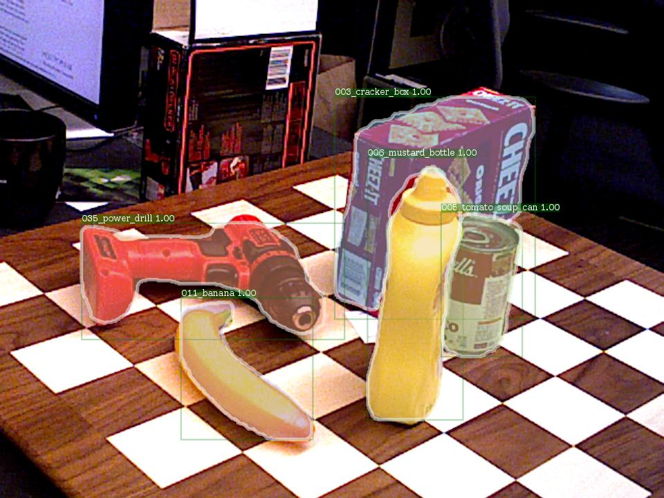
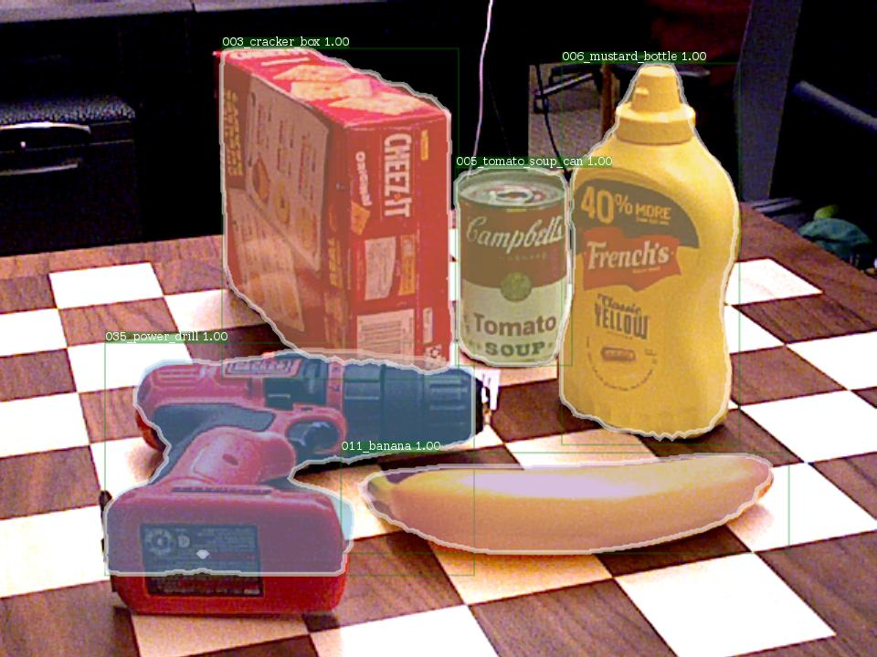

# Mask RCNN on YCB Video Dataset

## Introduction
This project aims to use the [YCB Video Dataset](https://rse-lab.cs.washington.edu/projects/posecnn/) to train a Mask RCNN using [Detectron](https://github.com/facebookresearch/Detectron) of the Facebook AI Research.

There are two choices for the training data, one is the synthetic data (data_syn) in the YCB Video Dataset, and the other is the training data specified in image_sets/train.txt of the YCB Video Dataset.

Because of the sole background of the synthetic data, the generalization performance of the model trained by the synthetic data is very poor. So the information below is about training the model using the images specified in image_sets/train.txt of the YCB Video Dataset.

## Environment
* [INSTALL.md](https://github.com/facebookresearch/Detectron/blob/master/INSTALL.md) provides the information about the requirements for using Detectron.
* The requirements for the annotation genereation are opencv and shapely.

## Annotation Generation
* video_data_annotations_generator.py: generate the annotations as the format of the [COCO Dataset](http://cocodataset.org/#home).
* data_syn_annotations_generator.py: the generation of the annotations of the synthetic data is also provided.

## Files in the [Detectron](https://github.com/facebookresearch/Detectron) which need to modify
* The five files need to be changed as described below is also uploaded to the files folder of this repository.
### $Detectron/detectron/datasets/dataset_catalog.py
* In the _DATASETS dictionary, add
```
    'ycb_video': {
            _IM_DIR:
            'path to/YCB_Video_Dataset/data',
            _ANN_FN:
            'path to/YCB_Video_Dataset/annotations/instances.json'
    },
```
### $Detectron/detectron/datasets/dummy_datasets.py
* Modify classes as \_\_background\_\_ and the classes we use
```
    classes = [
        '__background__', '002_master_chef_can', '003_cracker_box', '004_sugar_box',
        '005_tomato_soup_can', '006_mustard_bottle', '007_tuna_fish_can', '008_pudding_box',
        '009_gelatin_box', '010_potted_meat_can', '011_banana', '019_pitcher_base',
        '021_bleach_cleanser', '024_bowl', '025_mug', '035_power_drill', '036_wood_block', '037_scissors', 
        '040_large_marker', '051_large_clamp', '052_extra_large_clamp', '061_foam_brick'
    ]
```
### Edit the configuration file
* Choose one of the configuration file of the Mask RCNN in $Detectron/configs, such as $Detectron/configs/12_2017_baselines/e2e_mask_rcnn_R-101-FPN_2x.yaml
```
    MODEL:
      NUM_CLASSES: 22  # (1 (background) + number of classes)
    TRAIN:
      DATASETS: ('ycb_video',)
      SCALES: (480,)
      MAX_SIZE: 640 
```
* Also comment all the codes in the TEST of the configuration file, because I do the inference using infer_simple.py
* Other parameters such as NUM_GPUS, BASE_LR, MAX_ITER, etc., can be modified if needed.
* It is recommended that the BASE_LR should be set to a smaller value, such as 0.001, in order to addressing the "Loss is NaN" error.
### $Detectron/tools/infer_simple.py
#### In order to output a json file contains the segmentations results, some codes should be added.
* In the begging of the program
```
    import json
    import numpy as np
    import pycocotools.mask as mask_utils
```
* Before the for-loop of images
```
    json_output = []
```
* In the for-loop of images
```
    boxes, segms, keypoints, classes = vis_utils.convert_from_cls_format( cls_boxes, cls_segms, cls_keyps)

    if boxes is None:
        boxes = []
    else:
        boxes = boxes.tolist()
        
    segmentations = mask_utils.decode(segms)
    if segmentations is None:
        segmentations = []
    else:
        segmentations = np.swapaxes(segmentations, 0, 2)
        segmentations = np.swapaxes(segmentations, 1, 2)
        segmentations = segmentations.tolist()

    json_output.append({ \
        'image_name': im_name,
        'boxes': boxes,
        'classes': classes,
        'segms': segmentations
    })
```
* After the for-loop of images
```
    with open(args.output_dir + '/annotations.json', 'w') as outfile:
        json.dump(json_output, outfile)
```
### $Detectron/detectron/utils/env.py
* In order to addressing the error of "yaml.constructor.ConstructorError", replace
```
    yaml_load = yaml.load
```
* with
```
    yaml_load = lambda x: yaml.load(x, Loader = yaml.Loader)
```

## Training Step
* In the $Detectron directory
```
    python tools/train_net.py \
      --cfg configs/12_2017_baselines/e2e_mask_rcnn_R-101-FPN_2x.yaml \
      OUTPUT_DIR out_dir
```

## Detection
* Detect the images specified in image_sets/val.txt of the YCB Video Dataset.
```
    python tools/infer_simple.py \
      --cfg configs/12_2017_baselines/e2e_mask_rcnn_R-101-FPN_2x.yaml \
      --output-dir out_dir \
      --image-ext png \
      --wts path to/model_final.pkl \
      path_to_images_to_detect
```

## Results
* I train the model for 100, 000 iterations, and the detection results are quite well for bounding boxes, masks and categories.
<div align="center">
  
  <p>Detection Result Example 1</p>
</div>
<div align="center">
  
  <p>Detection Result Example 2</p>
</div>